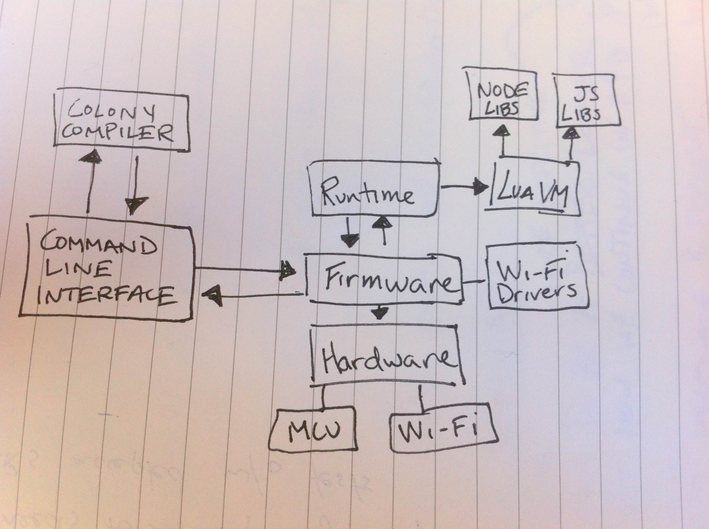

#Tessel System Overview

This is an overview of how all the components of Tessel work. It is intended to be a reference for those wishing to contribute to the internals of Tessel.

Tessel comprises the following:
 
* **Firmware** - C code that is the interface to all the hardware components (Wifi, RAM, Flash, SPI/UART/I2C busses). It also runs the event queue and handles interrupts.
* **Runtime** - the Lua VM running Lua code. It also includes the compatibility layer for core JS functions (String, Number, etc), as well as the core Node functions (fs, buffers, etc)
* **Colony** - JS -> Lua compiler
* **CLI** - the command line interface for communicating to a Tessel over a USB bus.

Here is a hand-drawn diagram of the system connections:

 

##Running Code

So what happens when you type `tessel run index.js` in your command line? 

1. Your command line searches your PATH for the `tessel` executable installed globally with `npm`. This is known as our Command Line Interface (CLI).

2. The executable will call [`tessel.js`](https://github.com/tessel/cli/blob/master/bin/tessel.js) which will search the available built-in commands and identify the requested command as [`tessel run`](https://github.com/tessel/cli/blob/master/bin/tessel.js#L61).

3. Tessel will [figure out what JavaScript files](https://github.com/tessel/cli/blob/master/src/script.js#L37) to push based on dependencies and blacklists in the `package.json` file and the contents of the `node_modules` folder.

4. Tessel will then use the Colony compiler to [transpile those JavaScript files](https://github.com/tessel/cli/blob/31cddb52966e82058f1e4da6125f8e00c66b8847/src/bundle.js#L69) to Lua source code and send a tarball of that code to Tessel (currently, over USB).

5. Tessel's firmware will [receive the command](https://github.com/tessel/firmware/blob/master/src/main.c#L93-L110) from USB and save the script into flash. We then [load the tarball into the Lua VM](https://github.com/tessel/firmware/blob/master/src/main.c#L471) in the runtime.

6. The runtime defines [global JavaScript functions](https://github.com/tessel/runtime/blob/master/src/colony/lua/colony-js.lua) and [Node Modules](https://github.com/tessel/runtime/tree/master/src/colony/modules) which the lua code calls into. 

7. When hardware access is needed, like WiFI calls, transferring data over the communication buses, or writing pin states, the runtime [calls into C functions](https://github.com/tessel/contribution-guide/blob/master/firmware-details.md#tessel-api).

8. When the process completes, the [runtime is shut down](https://github.com/tessel/firmware/blob/master/src/main.c#L488) and the [script memory is freed](https://github.com/tessel/firmware/blob/master/src/main.c#L473). 
